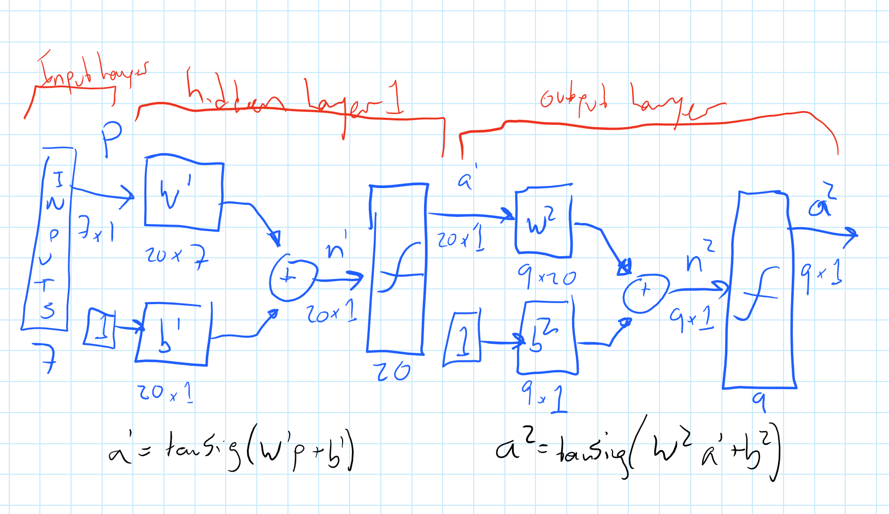

# ml_tle_2016_contest

Link to the contest: https://github.com/seg/2016-ml-contest

Here's a diagram of the current (20161111) net I'm going to try:

It's a really simple two layer perceptron with 20 neurons in the hidden layer.

Since Torch is garbage at handling CSV (or any file of meaning), I've included the lovely script by Scott Locklin which converts CSV to Torch7's serialized format. The script is here as "csv2t7.sh". The original can be found here: https://github.com/locklin/torch-things/blob/master/csv2t7.sh

